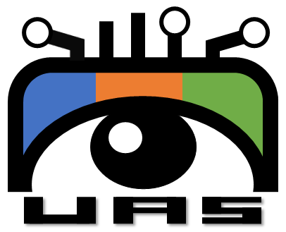
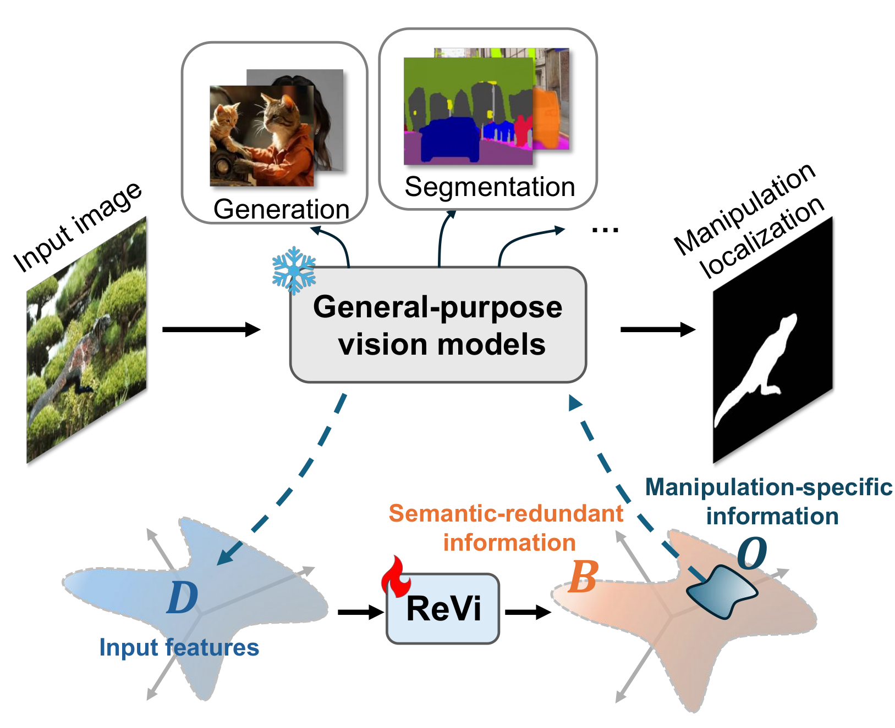
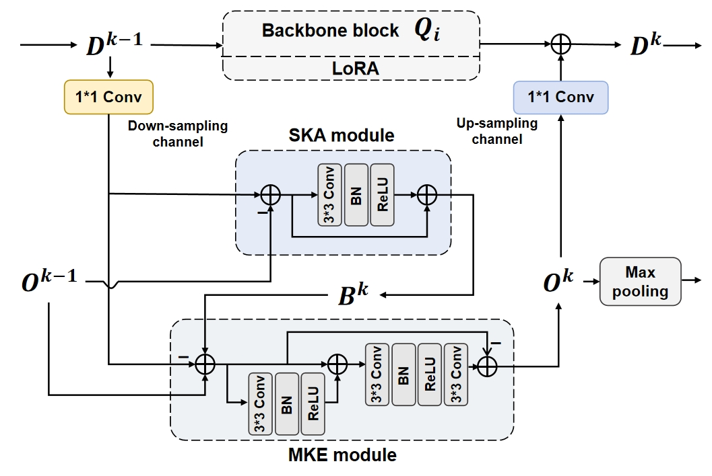

## Off-the-shelf Vision Models Benefit Image Manipulation Localization


This repository represents the official implementation of the paper titled "Off-the-shelf Vision Models Benefit Image Manipulation Localization".

[](https://arxiv.org/abs/2604.09096)  

[Zhengxuan Zhang](https://github.com/Johnson-u) , [Keji Song](https://github.com/Stech0109) , [Junmin Hu](https://github.com/JunminHuOUC) , [Ao Luo]() , [Yuezun Li](https://yuezunli.github.io)<sup>#</sup>, [](https://yuezunli.github.io/ligroup/) [Vas Group](https://yuezunli.github.io/ligroup/)

<sup>#</sup>Corresponding author.

<p align="center">
  
  
</p>

This code corresponds to the **ReVi** implementation based on the **[TinySAM](https://github.com/xinghaochen/TinySAM)** framework.

## 🛠️ Environment & Setup

The inference code was tested on:

Ubuntu 22.04 LTS, Python 3.10.12,  CUDA 12.8, GeForce RTX 3090ti


You can create a virtual environment and install the required dependency libraries in the following:

```python
pip install virtualenv
mkdir venv && cd venv
virtualenv ReVi
source ReVi/bin/activate
pip install -r requirements.txt
```


## 📦 Prepare for your dataset

**Dataset.**

1.   Download your datasets, such as [PSCC](https://github.com/proteus1991/PSCC-Net) and put them on a hard drive with plenty of memory.

2. Download other datasets you like, such as [CASIAv2](https://github.com/SunnyHaze/CASIA2.0-Corrected-Groundtruth), [CASIAv1](https://github.com/namtpham/casia1groundtruth), [Columbia](https://www.ee.columbia.edu/ln/dvmm/downloads/authsplcuncmp/), [Coverage](https://github.com/wenbihan/coverage), [NIST16](https://mig.nist.gov/MFC/PubData/Resources.html), [IMD20](https://staff.utia.cas.cz/novozada/db/IMD2020.zip).  

**Dataset preprocess.**

1. After downloading is complete, you should have two subdirectories, one for images and the other for groundtruth.
   ```
   .
   └── data
       ├── image
       └── gt
   ```

2. We recommend renaming the images and groundtruth in your dataset to have the same filenames and extensions. For example, in your CASIA dataset, you have a set of files as follows: 
   ```commandline
   Sp_D_CND_A_pla0005_pla0023_0281.jpg     Sp_D_CND_A_pla0005_pla0023_0281_gt.png
   ```
   After modification, the filenames when running the code should be:
   ```commandline
   Sp_D_CND_A_pla0005_pla0023_0281.png     Sp_D_CND_A_pla0005_pla0023_0281.png
   ```

3. For some incorrectly annotated data, we recommend ignoring those images or using their corrected versions, such as in [CASIAv2](https://github.com/SunnyHaze/CASIA2.0-Corrected-Groundtruth).
 
 

## 🏋️ Training

1. Before training, you need to download the [pre-trained weights](https://github.com/xinghaochen/TinySAM) for TinySAM and place them in the `pre_weight` folder. Alternatively, you can modify the configuration in the `train_config.yaml` file to specify a custom path.


2. Then you should put your train and val dataset to the `train_image/mask_dir` `val_image/mask_dir`


3. After you confirm the config in `train_config.yaml`, then you can use the below instruction and train your model: 

   ```python
    python train.py --config train_config.yaml
   ```

4. After training is complete, the best-performing weight file and the training loss plot will be stored in the root directory.


5. Since different datasets have different rules for matching images and groundtruth, we have included several common mapping methods. You can review and modify these mappings in `train.py`. **However, we strongly recommend that your images and groundtruth have the same filenames and extensions.**


## 🏃 Visualization and Testing

1. The testing configuration for **ReVi** is located in the `./infer_config.yaml` file. You can modify the relevant information in the file, especially the `checkpoint`, `input_folder`, `gt_folder`, and `output_folder`. After making the changes, you can run the testing code using the following command.
    ```python
   python infer.py
   ```
   Alternatively, you can also create a custom configuration file and test with the following command.
    ```python
   python infer.py --config "your config file"
   ```
   During the testing process, the visual localization results will be output to `output_folder`, and the **AUC** and **F1** scores of the test results will be reported.
   

2. We provide the [weights](https://pan.baidu.com/s/1oUzrqwsEFksXcp_UW59slg?pwd=82dn) of the **ReVi** version under the **Pre-trained protocol** (trained on the PSCC dataset) based on the TinySAM model. You can download it and place the files in `checkpoint`.


3. **Note: The filenames of your tampered image files and ground truth files must be consistent (extensions can differ); otherwise, an error will occur when calculating metrics. Also, please ensure that the two files have the same size.**


[//]: # (**Note: The model we are testing here is the model of the previous work that was trained using our method.**)


## ⏳ Todo List
To facilitate comparisons with other research efforts, we are working on integrating eight baseline methods and the four models from this paper into a **unified framework**. The specific codebase and usage details will be made public in the coming months.

## 🎓 Citation

Thanks for your attention, please cite our paper:

```bibtex
@misc{zhang2026offtheshelfvisionmodelsbenefit,
      title={Off-the-shelf Vision Models Benefit Image Manipulation Localization}, 
      author={Zhengxuan Zhang and Keji Song and Junmin Hu and Ao Luo and Yuezun Li},
      year={2026},
      eprint={2604.09096},
      archivePrefix={arXiv},
      primaryClass={cs.CV},
      url={https://arxiv.org/abs/2604.09096}, 
}
```
